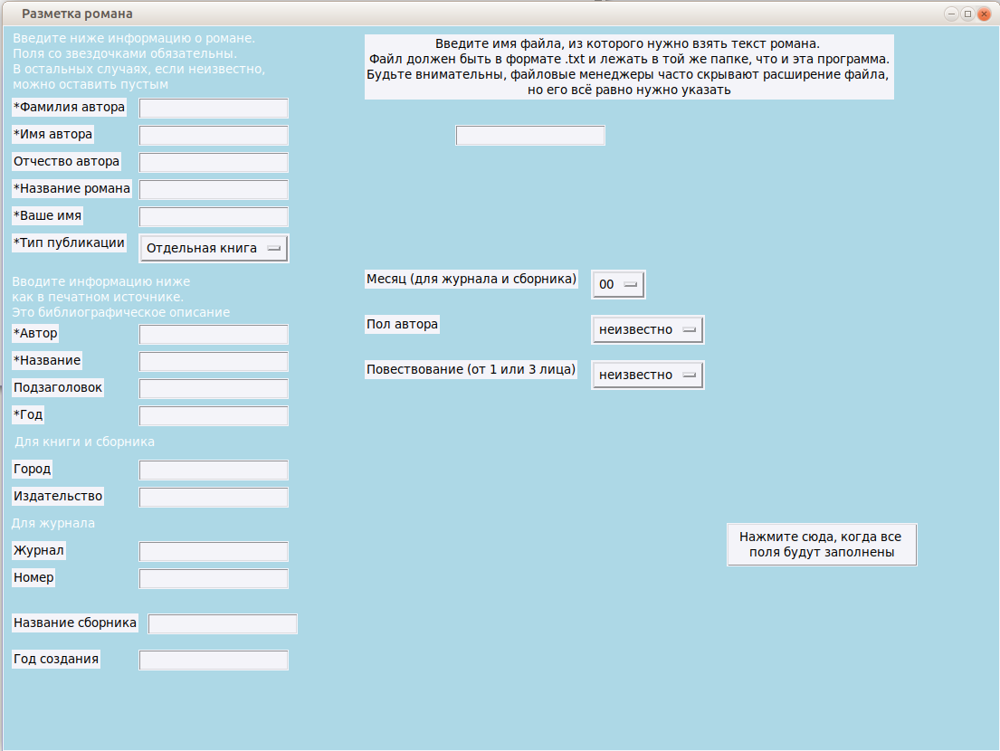

# rus-novel-desktop-app

Десктопное оконное приложение для создания размеченных файлов корпуса русского романа.

## Запуск

После установки интерпретатора языка Python и ассоциации файлов `.py` с этим 
интерпретатором программа должна работать без дополнительных настроек, не имеет 
дополнительных зависимостей от сторонних библиотек.

В оконных менеджерах запускается по двойному щелчку на файле с программой.

## Внешний вид

## Поведение

Если не заполнены какие-то обязательные поля (помечены звездочкой) или какие-то 
поля заполнены неверно (например, год не в формате `1875`), то после нажатия 
на главную кнопку выдается сообщение в отдельном окне.

Если все заполнено верно, то приложение записывает файл вида 
`tolstoj_l_kholstomer_1886.xml` в ту же директорию, в которой лежит программа 
(об этом тоже выводится сообщение).

Текст романа берется из указанного пользователем файла.

## Пример работы

[Файл с примером результата работы программы](tolstoj_l_kholstomer_1886.xml)

## Технические подробности

Оконная функциональность основана на библиотеке tkinter
